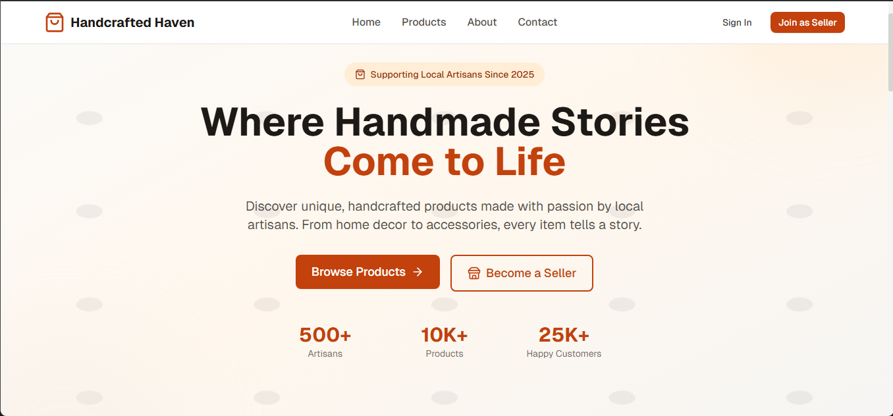

# Handcrafted Haven

> A marketplace where artisans can showcase and sell their handcrafted products.

🔗 **[Live Demo](https://handcrafted-haven-sand.vercel.app/)** &nbsp;|&nbsp; 👥 **Collaborative Course Project — BYU-Idaho**



---

## About

Handcrafted Haven is a full-stack marketplace platform built as a collaborative course project. It enables artisan sellers to create accounts, manage their store, and list products — while buyers can browse, filter by category, view product details, and leave reviews.

## Features

- **Seller Authentication** — Secure signup/login with bcrypt password hashing
- **Seller Dashboard** — Create, edit, and manage product listings with image upload
- **Product Catalog** — Browse and filter products by category
- **Product Details** — Full product page with description, price, and stock
- **Review System** — Customers can rate (1–5) and comment on products
- **Contact Form** — Built-in contact page with database-backed message storage
- **Responsive UI** — Mobile-friendly layout with Tailwind CSS

## Tech Stack

| Layer | Technology |
|---|---|
| **Framework** | Next.js 15 (App Router) |
| **Language** | TypeScript |
| **Styling** | Tailwind CSS |
| **Database** | Supabase (PostgreSQL) |
| **Auth** | Custom auth with bcryptjs |
| **Icons** | Lucide React |

## Database Schema

| Table | Description |
|---|---|
| `sellers` | Seller accounts with store info |
| `products` | Product listings linked to sellers and categories |
| `categories` | Product categories |
| `reviews` | Customer ratings and comments |
| `contacts` | Contact form submissions |

## Local Setup

```bash
# 1. Clone the repository
git clone https://github.com/Lucassilva027/Handcrafted-haven.git
cd Handcrafted-haven

# 2. Install dependencies
npm install

# 3. Configure environment variables
cp .env.example .env
# Fill in: NEXT_PUBLIC_SUPABASE_URL, NEXT_PUBLIC_SUPABASE_ANON_KEY

# 4. Set up database
# Run supabase-schema.sql in your Supabase Dashboard > SQL Editor

# 5. Start development server
npm run dev
# App running at http://localhost:3000
```

## Team

Built collaboratively by 4 developers as part of the BYU-Idaho curriculum.

| Contributor | GitHub |
|---|---|
| Lucas Silva | [@Lucassilva027](https://github.com/Lucassilva027) |
| Michael Kazembe | [@MichaelKazembe](https://github.com/MichaelKazembe) |
| Sergio Pontes | [@svpontes](https://github.com/svpontes) |
| Eyob Teff | [@EyobTeff](https://github.com/EyobTeff) |
